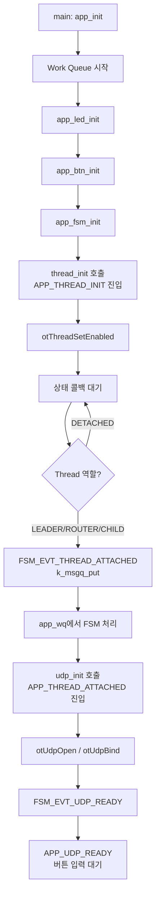
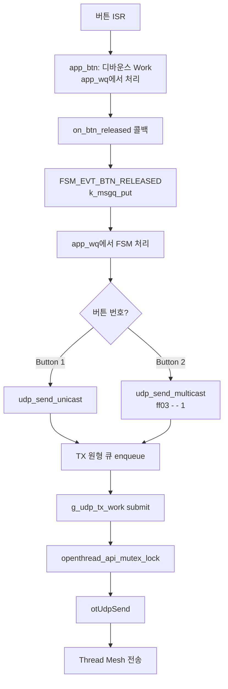

# Thread UDP 통신 미니프로젝트 명세서

> [!abstract] 문서 목적
> 이 문서는 nRF52840 DK 4대를 기반으로 OpenThread API를 코드로 직접 호출하여
> Thread 네트워크를 구성하고 UDP 통신을 구현하는 미니프로젝트의 명세서다.
> BLE Beacon 프로젝트의 코드 구조 수준(모듈 분리, FSM, Work Queue, 콜백 기반)을
> Thread UDP 프로젝트에 동일하게 적용하며,
> 이후 CoAP 모듈 추가 시 기존 코드를 최대한 재사용할 수 있도록 설계한다.

> [!info] 문서 버전
> - 버전: v0.3.0
> - 변경: 배터리 모듈 제거 / CoAP 확장 가능성 명시

---

## 목차

- [[#01. 프로젝트 개요]]
- [[#02. 시스템 아키텍처]]
- [[#03. 요구사항 명세서]]
- [[#04. 기능 명세서]]
- [[#05. 코드 구조 설계]]
- [[#06. 모듈 상세 설계]]
- [[#07. 데이터 구조 설계]]
- [[#08. CoAP 확장 설계]]
- [[#09. prj.conf 설정]]
- [[#10. 구현 흐름]]
- [[#11. 디버깅 체크리스트]]
- [[#12. 용어 정리]]

---

## 01. 프로젝트 개요

### 01.1 목표

```text
OpenThread API를 직접 코드로 다루면서
Thread 네트워크를 이해하는 것이 목적이다.
UDP는 Thread 네트워크 위에서 데이터를 주고받는 수단이다.

핵심 학습 목표:
  1. Thread 네트워크 초기화를 코드로 직접 구현
  2. UDP 송수신을 코드로 직접 구현
  3. 버튼으로 다른 기기 LED 제어 (유니캐스트)
  4. 멀티캐스트로 전체 노드 동시 제어
  5. 원형 큐(Circular Queue) 기반 송수신 버퍼 관리
  6. BLE Beacon 수준의 모듈 분리 / FSM / Work Queue 구조 적용
  7. 이후 CoAP 추가 시 기존 코드 재사용 가능한 구조 유지
```

### 01.2 개발 환경

```text
하드웨어:  nRF52840 DK × 4대
SDK:       nRF Connect SDK v3.0
RTOS:      Zephyr
Thread:    OpenThread (NCS 내장)
API:       OpenThread 네이티브 API
언어:      C
IDE:       VS Code + nRF Connect 확장
```

### 01.3 BLE Beacon과의 구조 대응

```text
BLE Beacon 구조              Thread UDP 구조
─────────────────────────────────────────────────
src/main.c                → src/main.c
src/ble/ble.c             → src/thread/thread.c
src/ble_svc/nus_svc.c     → src/udp/udp.c
src/app/app_main.c        → src/app/app_main.c
src/app/app_fsm.c         → src/app/app_fsm.c
src/app/app_btn.c         → src/app/app_btn.c   (재사용)
src/app/app_led.c         → src/app/app_led.c   (재사용)
src/sys_raw/battery.c     → 제거
─ (없음) ─                → src/udp/circular_queue.c
─ (없음) ─                → src/coap/coap.c      (CoAP 단계에서 추가)
```

---

## 02. 시스템 아키텍처

### 02.1 네트워크 토폴로지

```
[보드 A]          [보드 B]          [보드 C]          [보드 D]
Leader /           Router            Router            End Device
UDP Server                                             UDP Client

  ↑                  ↑                 ↑                  ↓
  └──────────────────┴─────────────────┴──────────────────┘
                   Thread Mesh (IEEE 802.15.4)
                         UDP / IPv6
```

### 02.2 레이어 구조

```
┌──────────────────────────────────────────────────────┐
│  Application Layer                                    │
│  app_fsm: 상태 관리 / app_btn: 버튼 이벤트            │
│  app_led: LED 제어                                    │
├──────────────────────────────────────────────────────┤
│  Protocol Layer                                       │
│  udp.c: UDP 송수신 / circular_queue.c: TX/RX 버퍼    │
│  coap.c: CoAP 리소스/핸들러 (CoAP 단계에서 추가)      │
├──────────────────────────────────────────────────────┤
│  Thread Layer                                         │
│  thread.c: 네트워크 초기화 / 상태 콜백 관리            │
├──────────────────────────────────────────────────────┤
│  OpenThread Stack (NCS 내장)                          │
│  IPv6 / 6LoWPAN / IEEE 802.15.4                      │
└──────────────────────────────────────────────────────┘
```

### 02.3 이벤트 흐름

```
[버튼 ISR]
    ↓ gpio_add_callback
[app_btn: 디바운스 Work]
    ↓ 콜백 (Work Queue 컨텍스트)
[app_fsm: 이벤트 큐 post]
    ↓ k_msgq_put → k_work_submit
[app_fsm: Work Queue에서 상태 전이]
    ↓ udp_send_unicast / udp_send_multicast
[udp: TX 원형 큐 enqueue]
    ↓ openthread_api_mutex_lock
[otUdpSend]
    ↓ Thread Mesh
[수신 노드 UDP 콜백]
    ↓ RX 원형 큐 enqueue → FSM 이벤트 post
[app_fsm: RX 처리 → LED 제어]
```

---

## 03. 요구사항 명세서

### 03.1 기능 요구사항

#### FR-01. Thread 네트워크 구성

| ID | 요구사항 | 우선순위 |
|----|---------|---------|
| FR-01-1 | OT CLI 없이 코드로만 Thread 네트워크 파라미터를 설정한다 | 필수 |
| FR-01-2 | 4대의 보드가 동일한 Network Key / Channel / PAN ID로 자동 참여한다 | 필수 |
| FR-01-3 | Thread 네트워크 상태 변화를 콜백으로 감지하여 FSM 이벤트로 전달한다 | 필수 |
| FR-01-4 | Thread 초기화는 FSM이 THREAD_INIT 상태에 진입할 때 수행한다 | 필수 |
| FR-01-5 | 노드 역할(Leader / Router / Child)을 LED로 표시한다 | 필수 |

#### FR-02. UDP 통신

| ID | 요구사항 | 우선순위 |
|----|---------|---------|
| FR-02-1 | Thread 네트워크 참여 완료 후에만 UDP 소켓을 초기화한다 | 필수 |
| FR-02-2 | 유니캐스트 UDP로 특정 노드에 메시지를 전송한다 | 필수 |
| FR-02-3 | 멀티캐스트 UDP로 전체 노드에 메시지를 동시 전송한다 | 필수 |
| FR-02-4 | otUdpSend()는 반드시 Work Queue 컨텍스트에서만 호출한다 | 필수 |
| FR-02-5 | UDP 수신 콜백에서 송신자 IPv6 주소를 파악한다 | 필수 |

#### FR-03. 원형 큐 버퍼

| ID | 요구사항 | 우선순위 |
|----|---------|---------|
| FR-03-1 | TX / RX 각각 독립된 원형 큐를 사용한다 | 필수 |
| FR-03-2 | 원형 큐는 고정 크기 배열 기반으로 구현한다 | 필수 |
| FR-03-3 | 큐가 가득 찬 경우 오래된 데이터를 덮어쓴다 | 필수 |
| FR-03-4 | enqueue / dequeue는 mutex로 thread-safe하게 구현한다 | 필수 |

#### FR-04. 버튼 / LED 제어

| ID | 요구사항 | 우선순위 |
|----|---------|---------|
| FR-04-1 | 버튼 이벤트는 디바운스 후 Work Queue 컨텍스트에서 FSM으로 전달한다 | 필수 |
| FR-04-2 | Button 1: 유니캐스트 UDP 전송 (페어링된 노드 LED 제어) | 필수 |
| FR-04-3 | Button 2: 멀티캐스트 UDP 전송 (전체 노드 LED 동시 제어) | 필수 |
| FR-04-4 | LED 1: Thread 네트워크 연결 상태 표시 | 필수 |
| FR-04-5 | LED 4: UDP 수신 시 토글 | 필수 |

#### FR-05. FSM 상태 관리

| ID | 요구사항 | 우선순위 |
|----|---------|---------|
| FR-05-1 | 모든 상태 전이는 단일 Work Queue(app_wq)에서만 수행한다 | 필수 |
| FR-05-2 | 외부 이벤트(Thread 콜백, UDP 수신)는 k_msgq를 통해 FSM으로 전달한다 | 필수 |
| FR-05-3 | FSM 상태: SYS_INIT → THREAD_INIT → THREAD_ATTACHED → UDP_READY | 필수 |
| FR-05-4 | CoAP 추가 시 FSM 이벤트 타입과 상태만 확장하고 기존 구조는 유지한다 | 권장 |

---

### 03.2 비기능 요구사항

| ID | 요구사항 | 기준 |
|----|---------|------|
| NFR-01 | Thread 네트워크 참여 시간 | 부팅 후 30초 이내 |
| NFR-02 | UDP 메시지 전송 지연 | 유니캐스트 기준 500ms 이내 |
| NFR-03 | 원형 큐 크기 | TX / RX 각 16개 슬롯 |
| NFR-04 | UDP 포트 | 1212 (고정) |
| NFR-05 | 메시지 최대 크기 | 64바이트 |
| NFR-06 | Work Queue 스택 크기 | 4096 bytes |

---

## 04. 기능 명세서

### 04.1 FSM 상태 정의

```
APP_SYS_INIT
  → 시스템 부팅
  → LED / 버튼 초기화 완료 후 THREAD_INIT으로 전이

APP_THREAD_INIT
  → Thread 네트워크 파라미터 설정
  → otThreadSetEnabled() 호출
  → 네트워크 참여 대기

APP_THREAD_ATTACHED
  → Leader / Router / Child 역할 확정
  → LED 1 ON
  → UDP 소켓 초기화 트리거

APP_UDP_READY
  → UDP 소켓 열림 완료
  → 버튼 이벤트 수신 및 UDP 송수신 가능
```

### 04.2 FSM 이벤트 타입

```c
/* UDP 단계 */
enum fsm_evt_type {
    FSM_EVT_THREAD_ATTACHED = 0,  /* Thread 네트워크 참여 완료 */
    FSM_EVT_THREAD_DETACHED,      /* Thread 네트워크 이탈     */
    FSM_EVT_UDP_READY,            /* UDP 소켓 초기화 완료     */
    FSM_EVT_UDP_RX,               /* UDP 메시지 수신          */
    FSM_EVT_BTN_RELEASED,         /* 버튼 해제                */
};

struct fsm_evt {
    enum fsm_evt_type type;
    union {
        struct {
            uint8_t  num;       /* 버튼 번호 */
            uint32_t dur_ms;    /* 눌림 시간 */
        } btn;
        otDeviceRole thread_role;
    } u;
};
```

> [!tip] CoAP 확장 시
> `FSM_EVT_COAP_RX`, `FSM_EVT_COAP_READY` 이벤트 타입만 추가하면 된다.
> 기존 이벤트 처리 구조는 그대로 유지된다.

### 04.3 이벤트 큐 구조 (BLE Beacon 패턴 동일)

```c
K_MSGQ_DEFINE(g_fsm_evt_q, sizeof(struct fsm_evt), 8, 4);
static struct k_work g_fsm_evt_work;

static void fsm_evt_post(const struct fsm_evt *evt)
{
    k_msgq_put(&g_fsm_evt_q, evt, K_NO_WAIT);
    k_work_submit_to_queue(g_wq, &g_fsm_evt_work);
}
```

### 04.4 Thread 초기화 (thread.c)

```c
int thread_init(void)
{
    otInstance *instance = openthread_get_default_instance();

    /* 상태 변화 콜백 등록 */
    otSetStateChangedCallback(instance,
                              on_thread_state_changed,
                              NULL);

    /* 네트워크 파라미터 설정 */
    otLinkSetChannel(instance, THREAD_CHANNEL);
    otLinkSetPanId(instance, THREAD_PAN_ID);

    otNetworkKey key = {THREAD_NETWORK_KEY};
    otThreadSetNetworkKey(instance, &key);

    /* Thread 시작 */
    otIp6SetEnabled(instance, true);
    otThreadSetEnabled(instance, true);

    return 0;
}

/* Thread 상태 변화 → FSM 이벤트 post */
static void on_thread_state_changed(otChangedFlags flags,
                                    void *context)
{
    if (!(flags & OT_CHANGED_THREAD_ROLE)) {
        return;
    }

    otDeviceRole role =
        otThreadGetDeviceRole(
            openthread_get_default_instance());

    struct fsm_evt evt;

    switch (role) {
    case OT_DEVICE_ROLE_LEADER:
    case OT_DEVICE_ROLE_ROUTER:
    case OT_DEVICE_ROLE_CHILD:
        evt.type         = FSM_EVT_THREAD_ATTACHED;
        evt.u.thread_role = role;
        fsm_evt_post(&evt);
        break;

    case OT_DEVICE_ROLE_DETACHED:
    case OT_DEVICE_ROLE_DISABLED:
        evt.type = FSM_EVT_THREAD_DETACHED;
        fsm_evt_post(&evt);
        break;

    default:
        break;
    }
}
```

### 04.5 UDP 모듈 (udp.c)

```c
int udp_init(void)
{
    otInstance *instance = openthread_get_default_instance();
    otSockAddr  addr;

    memset(&g_socket, 0, sizeof(g_socket));
    memset(&addr,     0, sizeof(addr));
    addr.mPort = UDP_PORT;

    otUdpOpen(instance, &g_socket, udp_rx_handler, NULL);
    otUdpBind(instance, &g_socket, &addr, OT_NETIF_THREAD);

    /* UDP 준비 완료 → FSM 이벤트 post */
    struct fsm_evt evt = { .type = FSM_EVT_UDP_READY };
    fsm_evt_post(&evt);

    return 0;
}

/* 유니캐스트 전송 */
int udp_send_unicast(const char *dest_ipv6,
                     const udp_msg_t *msg)
{
    circular_queue_enqueue(&g_tx_queue, msg);
    k_work_submit_to_queue(g_wq, &g_tx_work);
    return 0;
}

/* 멀티캐스트 전송 */
int udp_send_multicast(const udp_msg_t *msg)
{
    return udp_send_unicast(UDP_MULTICAST_ADDR, msg);
}

/* TX Work: Work Queue에서 otUdpSend 호출 */
static void udp_tx_work_handler(struct k_work *work)
{
    udp_msg_t msg;

    while (circular_queue_dequeue(&g_tx_queue, &msg)) {
        openthread_api_mutex_lock(
            openthread_get_default_context());
        udp_send_internal(&msg);
        openthread_api_mutex_unlock(
            openthread_get_default_context());
    }
}

/* RX 콜백 → 큐 enqueue → FSM 이벤트 post */
static void udp_rx_handler(void *ctx,
                            otMessage *message,
                            const otMessageInfo *info)
{
    udp_msg_t msg;

    udp_msg_from_ot(message, info, &msg);
    circular_queue_enqueue(&g_rx_queue, &msg);

    struct fsm_evt evt = { .type = FSM_EVT_UDP_RX };
    fsm_evt_post(&evt);
}
```

### 04.6 버튼 모듈 (app_btn.c) — BLE Beacon 구조 재사용

```c
/* nRF52840 DK 버튼 4개 (sw0~sw3) 처리 */

struct app_btn_callbacks {
    void (*pressed)(uint8_t btn_num, void *user_data);
    void (*released)(uint8_t btn_num,
                     int64_t dur_ms,
                     void *user_data);
};

/* app_main.c에서 연결 */
static void on_btn_released(uint8_t btn_num,
                             int64_t dur_ms,
                             void *user_data)
{
    struct fsm_evt evt = {
        .type       = FSM_EVT_BTN_RELEASED,
        .u.btn.num    = btn_num,
        .u.btn.dur_ms = (uint32_t)dur_ms,
    };
    fsm_evt_post(&evt);
}
```

---

## 05. 코드 구조 설계

### 05.1 파일 구조

```
src/
 ├─ main.c                  ← 진입점만 (app_init + k_sleep(K_FOREVER))
 │
 ├─ thread/
 │   ├─ thread.c            ← Thread 초기화, 상태 콜백
 │   └─ thread.h
 │
 ├─ udp/
 │   ├─ udp.c               ← UDP 소켓, 송수신, TX Work
 │   ├─ udp.h
 │   ├─ circular_queue.c    ← TX / RX 원형 큐
 │   └─ circular_queue.h
 │
 ├─ coap/                   ← CoAP 단계에서 추가
 │   ├─ coap.c
 │   └─ coap.h
 │
 └─ app/
     ├─ app_main.c          ← Work Queue 생성, 모듈 글루
     ├─ app_main.h
     ├─ app_fsm.c           ← 상태 머신, 이벤트 큐
     ├─ app_fsm.h
     ├─ app_btn.c           ← 버튼 디바운스, 콜백
     ├─ app_btn.h
     ├─ app_led.c           ← LED 제어
     └─ app_led.h

inc/
 ├─ thread/thread.h
 ├─ udp/udp.h
 ├─ udp/circular_queue.h
 ├─ app/app_fsm.h
 ├─ app/app_btn.h
 └─ app/app_led.h

CMakeLists.txt
prj.conf
```

### 05.2 모듈 간 의존성

```
main.c
  └─ app/app_main.c
       ├─ app/app_fsm.c
       │    ├─ thread/thread.c   (Thread 초기화, 상태 감지)
       │    ├─ udp/udp.c         (UDP 송수신)
       │    └─ app/app_led.c     (LED 제어)
       └─ app/app_btn.c          (버튼 이벤트 → FSM)

udp/udp.c
  └─ udp/circular_queue.c        (TX/RX 버퍼)
```

### 05.3 Work Queue 구조

```
[app_wq] ← 애플리케이션 전용 단일 Work Queue
  │
  ├─ g_fsm_evt_work       ← FSM 이벤트 처리
  ├─ g_btn_debounce_work  ← 버튼 디바운스
  ├─ g_udp_tx_work        ← UDP TX 전송
  └─ g_led_work           ← LED 상태 업데이트

규칙:
  모든 상태 전이, otUdpSend()는
  반드시 app_wq 컨텍스트에서만 수행한다.
  ISR에서 직접 처리하지 않는다.
```

---

## 06. 모듈 상세 설계

### 06.1 main.c

```c
int main(void)
{
    int err;

    err = app_init();
    if (err != 0) {
        printk("[MAIN] app_init failed: %d\n", err);
        return err;
    }

    while (1) {
        k_sleep(K_FOREVER);
    }

    return 0;
}
```

### 06.2 app_main.c

```c
K_THREAD_STACK_DEFINE(g_app_wq_stack, APP_WQ_STACK_SIZE);
static struct k_work_q g_app_wq;

int app_init(void)
{
    k_work_queue_start(&g_app_wq,
                       g_app_wq_stack,
                       K_THREAD_STACK_SIZEOF(g_app_wq_stack),
                       APP_WQ_PRIORITY, NULL);

    app_led_init(&g_app_wq);

    struct app_btn_callbacks btn_cbs = {
        .released = on_btn_released,
    };
    app_btn_init(&g_app_wq, &btn_cbs, NULL);

    app_fsm_init(&g_app_wq);

    return 0;
}
```

### 06.3 app_fsm.c

```c
static void fsm_evt_work_handler(struct k_work *work)
{
    struct fsm_evt evt;

    while (k_msgq_get(&g_fsm_evt_q, &evt, K_NO_WAIT) == 0) {
        switch (evt.type) {

        case FSM_EVT_THREAD_ATTACHED:
            if (g_state == APP_THREAD_INIT) {
                app_led_set(LED_1, true);
                udp_init();
                g_state = APP_THREAD_ATTACHED;
            }
            break;

        case FSM_EVT_THREAD_DETACHED:
            app_led_set(LED_1, false);
            g_state = APP_THREAD_INIT;
            break;

        case FSM_EVT_UDP_READY:
            if (g_state == APP_THREAD_ATTACHED) {
                g_state = APP_UDP_READY;
            }
            break;

        case FSM_EVT_UDP_RX:
            app_led_toggle(LED_4);
            break;

        case FSM_EVT_BTN_RELEASED:
            if (g_state != APP_UDP_READY) break;

            if (evt.u.btn.num == 0) {
                /* Button 1: 유니캐스트 */
                udp_msg_t msg = make_led_toggle_msg();
                udp_send_unicast(g_peer_addr, &msg);

            } else if (evt.u.btn.num == 1) {
                /* Button 2: 멀티캐스트 */
                udp_msg_t msg = make_led_toggle_msg();
                udp_send_multicast(&msg);
            }
            break;

        default:
            break;
        }
    }
}
```

---

## 07. 데이터 구조 설계

### 07.1 UDP 메시지 포맷

```c
typedef enum {
    MSG_TYPE_LED_TOGGLE  = 0x01,
    MSG_TYPE_LED_ON      = 0x02,
    MSG_TYPE_LED_OFF     = 0x03,
} msg_type_t;

typedef struct {
    uint8_t  type;         /* msg_type_t */
    uint8_t  seq;          /* 시퀀스 번호 */
    uint16_t node_id;      /* 송신 노드 ID */
    uint8_t  payload[60];
} __attribute__((packed)) udp_msg_t;
```

### 07.2 버튼 동작 정의

| 버튼 | 동작 | 기능 |
|------|------|------|
| Button 1 (sw0) | 단순 클릭 | 유니캐스트 LED TOGGLE |
| Button 2 (sw1) | 단순 클릭 | 멀티캐스트 LED TOGGLE |
| Button 3 (sw2) | 단순 클릭 | (확장 예약) |
| Button 4 (sw3) | 단순 클릭 | 큐 상태 로그 출력 |

### 07.3 LED 동작 정의

| LED | 상태 | 의미 |
|-----|------|------|
| LED 1 | ON | Thread 네트워크 연결됨 |
| LED 2 | ON=Leader / 깜빡=Router | 노드 역할 |
| LED 3 | TX 중 ON | UDP 전송 중 |
| LED 4 | 수신 시 토글 | UDP RX |

### 07.4 원형 큐

```c
#define CQ_SIZE         16
#define UDP_MSG_MAX_LEN 64

typedef struct {
    udp_msg_t      buffer[CQ_SIZE];
    uint8_t        head;
    uint8_t        tail;
    uint8_t        count;
    struct k_mutex lock;
} circular_queue_t;
```

---

## 08. CoAP 확장 설계

> [!info] 이 섹션은 UDP 단계 완료 후 CoAP 추가 시 참고한다.

### 08.1 재사용되는 것 / 추가되는 것

```
재사용 (변경 없음):
  main.c
  thread/thread.c
  app/app_main.c
  app/app_btn.c
  app/app_led.c
  udp/udp.c            (UDP는 유지)
  udp/circular_queue.c

추가:
  coap/coap.c          ← CoAP 서버/클라이언트 구현

수정 (최소):
  app/app_fsm.c        ← FSM 이벤트 타입 추가, 케이스 추가
  prj.conf             ← CONFIG_COAP=y 추가
```

### 08.2 FSM 확장 방향

```c
/* UDP 단계의 이벤트 타입 유지 + CoAP 이벤트 추가 */
enum fsm_evt_type {
    /* UDP 단계 (기존 유지) */
    FSM_EVT_THREAD_ATTACHED,
    FSM_EVT_THREAD_DETACHED,
    FSM_EVT_UDP_READY,
    FSM_EVT_UDP_RX,
    FSM_EVT_BTN_RELEASED,

    /* CoAP 단계 (추가) */
    FSM_EVT_COAP_READY,   /* CoAP 서버 초기화 완료 */
    FSM_EVT_COAP_RX,      /* CoAP 요청 수신        */
};
```

### 08.3 CoAP 모듈 인터페이스

```c
/* coap/coap.h */

/* CoAP 서버 초기화 (리소스 등록) */
int coap_server_init(void);

/* CoAP 클라이언트: GET 요청 */
int coap_send_get(const char *dest_ipv6,
                  const char *uri_path);

/* CoAP 클라이언트: PUT 요청 */
int coap_send_put(const char *dest_ipv6,
                  const char *uri_path,
                  const uint8_t *payload,
                  uint16_t len);
```

### 08.4 CoAP 추가 시 버튼 동작 확장

```
UDP 단계:
  Button 1 → 유니캐스트 UDP
  Button 2 → 멀티캐스트 UDP

CoAP 추가 후:
  Button 1 → 유니캐스트 UDP    (그대로)
  Button 2 → 멀티캐스트 UDP    (그대로)
  Button 3 → CoAP GET /rssi   (추가)
  Button 4 → CoAP PUT /led    (추가)
```

---

## 09. prj.conf 설정

```conf
# ── Thread / OpenThread ──────────────────────────
CONFIG_NET_L2_OPENTHREAD=y
CONFIG_OPENTHREAD_FTD=y
CONFIG_OPENTHREAD_MANUAL_START=y
CONFIG_OPENTHREAD_NETWORKKEY="00:11:22:33:44:55:66:77:88:99:aa:bb:cc:dd:ee:ff"

# ── 네트워킹 ──────────────────────────────────────
CONFIG_NETWORKING=y
CONFIG_NET_IPV6=y
CONFIG_NET_UDP=y

# CoAP 단계에서 추가
# CONFIG_COAP=y

# ── DK 라이브러리 ─────────────────────────────────
CONFIG_DK_LIBRARY=y

# ── Flash / Settings ─────────────────────────────
CONFIG_FLASH=y
CONFIG_FLASH_MAP=y
CONFIG_NVS=y
CONFIG_SETTINGS=y
CONFIG_SETTINGS_NVS=y

# ── 전원 관리 ─────────────────────────────────────
CONFIG_PM=y
CONFIG_PM_DEVICE=y
CONFIG_PM_DEVICE_RUNTIME=y

# ── 로깅 ─────────────────────────────────────────
CONFIG_PRINTK=y
CONFIG_LOG=y
CONFIG_LOG_DEFAULT_LEVEL=3
CONFIG_OPENTHREAD_LOG_LEVEL_INFO=y
CONFIG_THREAD_NAME=y

# ── 스택 크기 ─────────────────────────────────────
CONFIG_MAIN_STACK_SIZE=4096
CONFIG_SYSTEM_WORKQUEUE_STACK_SIZE=4096
```

---

## 10. 구현 흐름

### 10.1 부팅 → UDP 준비까지



### 10.2 버튼 → UDP 전송 흐름



---

## 11. 디버깅 체크리스트

### 11.1 Thread 네트워크 참여 실패

```text
[ ] Network Key 4대 동일한가?
[ ] Channel / PAN ID 동일한가?
[ ] otIp6SetEnabled() → otThreadSetEnabled() 순서 맞는가?
[ ] CONFIG_OPENTHREAD_MANUAL_START=y 설정했는가?
[ ] on_thread_state_changed 콜백 등록됐는가?
[ ] LOG에서 OT_DEVICE_ROLE 값 확인
```

### 11.2 UDP 전송 실패

```text
[ ] APP_UDP_READY 상태에서 전송하는가?
[ ] otUdpBind() OT_NETIF_THREAD 설정했는가?
[ ] otUdpSend()를 app_wq 컨텍스트에서 호출하는가?
[ ] openthread_api_mutex_lock/unlock 감싸고 있는가?
[ ] 목적지 IPv6 주소 올바른가?
[ ] otUdpSend() 반환값 OT_ERROR_NONE 확인
```

### 11.3 버튼 이벤트 미동작

```text
[ ] app_btn_init()에 올바른 Work Queue 전달했는가?
[ ] DT_ALIAS(sw0~sw3) DeviceTree 설정 확인
[ ] FSM 상태가 APP_UDP_READY인가?
[ ] k_msgq_put() 반환값 0 확인 (큐 가득 찬 경우 유실)
```

### 11.4 멀티캐스트 수신 안 될 때

```text
[ ] 멀티캐스트 주소 ff03::1 사용했는가?
[ ] 수신 측 포트 1212 맞는가?
[ ] 모든 보드가 같은 Thread 네트워크에 있는가?
[ ] RX 콜백에서 FSM 이벤트 post 하는가?
```

---

## 12. 용어 정리

| 용어 | 의미 |
|------|------|
| **FSM** | Finite State Machine, 유한 상태 머신 |
| **Work Queue** | Zephyr 비동기 작업 큐, 별도 스레드에서 실행 |
| **k_msgq** | Zephyr 메시지 큐, ISR/스레드 간 이벤트 전달 |
| **k_work** | Work Queue에 제출하는 작업 단위 |
| **app_wq** | 애플리케이션 전용 단일 Work Queue |
| **otUdpSend** | OpenThread UDP 전송 API |
| **OT_NETIF_THREAD** | Thread 네트워크 인터페이스 식별자 |
| **ff03::1** | Mesh-Local All Nodes 멀티캐스트 주소 |
| **원형 큐** | 고정 크기 FIFO, 가득 차면 오래된 데이터 덮어씀 |
| **Mesh-Local** | Thread 메시 전체에서 유효한 IPv6 주소 (fd00::/8) |
| **openthread_api_mutex** | OpenThread API 호출 시 필요한 뮤텍스 |
